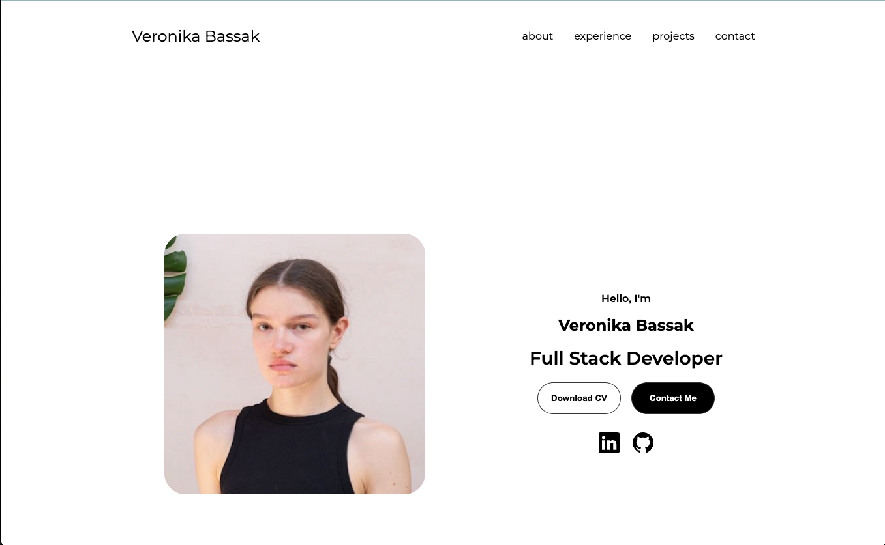

# Veronika Bassak — Portfolio

  

A clean, responsive, **HTML/CSS/vanilla JS** portfolio.  
Built for the Founders & Coders application to: introduce me, show why I’m moving into web development, and showcase projects—**without** any external libraries.

- **Live:** https://veronicabassak.github.io/portfolio/  
- **Repo:** https://github.com/veronicabassak/portfolio

---

## Table of contents
- [Features](#features)
- [Tech](#tech)
- [Structure](#structure)
- [Getting started](#getting-started)
- [Accessibility notes](#accessibility-notes)
- [Credits](#credits)
- [License](#license)
- [Contact](#contact)

---

## Features

- **Responsive layout** from mobile → desktop with tailored media queries.
- **Hero** with quick actions (CV download, contact) and social links.
- **About** with experience/education cards and a concise two-paragraph story.
- **Experience** section grouped by skills.
- **Projects** grid with images, one lightweight JS **slideshow**.
- **Contact form** with client-side validation + a **mailto fallback** if a mail client doesn’t open.
- **Mobile nav** with a hamburger toggle.
- **No frameworks**: just semantic HTML, modern CSS, and vanilla JS.

---

## Tech

- HTML5, CSS3 (custom properties, grid/flex, media queries)
- Vanilla JavaScript (small utilities: menu toggle, slideshow, form validation)
- Google Fonts: *Montserrat*
- Hosted on **GitHub Pages**

_No Bootstrap/React/jQuery/etc._

---

## Structure

~~~~
.
├── index.html
├── style.css
├── mediaqueries.css
├── script.js
├── assets/
│   ├── icons/               
│   ├── images/               
│   └── CV_Bassak_Veronika.pdf
├── hero.png                 
└── README.md
~~~~

## Getting started

### 1) Clone
~~~bash
git clone https://github.com/veronicabassak/portfolio.git
cd portfolio
~~~

### 2) Run locally
No build step required—just open `index.html` in your browser.

- **VS Code**: right-click `index.html` → “Open with Live Server” (optional).
- Or double-click `index.html` from your file explorer.

## Accessibility notes

- Meaningful landmarks and headings for screen readers.
- Sufficient color contrast on text/buttons.
- Focus states preserved on interactive elements.
- Form fields use native validation attributes and inline error messaging.
- Images include `alt` text; decorative icons marked appropriately.

## Credits

- **Icons:** Bootstrap Icons (SVG files bundled locally).
- **Font:** [Montserrat](https://fonts.google.com/specimen/Montserrat) (Google Fonts).
- **All code & layout:** © Veronika Bassak.

## License

Code in this repository is shared for portfolio purposes.  
© 2025 Veronika Bassak. All rights reserved.

## Contact

- **Live site:** https://veronicabassak.github.io/portfolio/  
- **Repo:** https://github.com/veronicabassak/portfolio  
- **LinkedIn:** https://www.linkedin.com/in/veronica-bassak-1ab055165/
